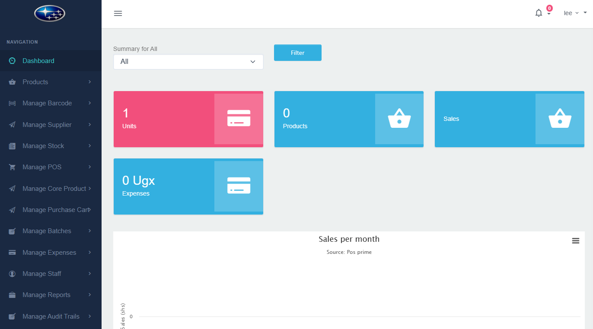

# Business-POS / Posprime

## About Posprime

Posprime (Business-POS) is a multi-tenant point-of-sale and inventory management platform that helps small and medium retailers and vendors manage in-store sales, stock, expenses and reporting. It provides a lightweight POS interface, robust stock control, vendor-specific dashboards and reporting, and tools to streamline daily store operations.

Posprime focuses on in-store operations — it does not provide an online storefront or direct online sales channels. Instead, it helps individual vendors and shops operate efficiently at the point-of-sale and maintain accurate inventory across batches, units and suppliers. The platform also supports entrepreneurship by providing business insights, low-stock alerts and vendor onboarding for multi-location or group-managed retail setups.

Key modules:
- Staff
- Products
- Barcode
- Suppliers
- Stock / Inventory
- POS (checkout)
- Core products
- Purchase cart
- Batch management
- Expenses
- Reports
- Audit trails
- Leaves
- Tasks
- Notifications

## Usage & Notes
- To re-run seeding / reset sample data, check `config/laratrust_seeder.php` for `truncate_tables` and `create_users` options.
- The application is intended for in-store POS and inventory workflows; online selling components are not included by default.
- Keep secrets out of the repository; use `.env` and do not commit it.
- For production, configure a proper database, queue, and storage (use cloud storage for uploads) and enforce HTTPS.

### Navigate through the system and enjoy its customized built-in features.

Cheers!
