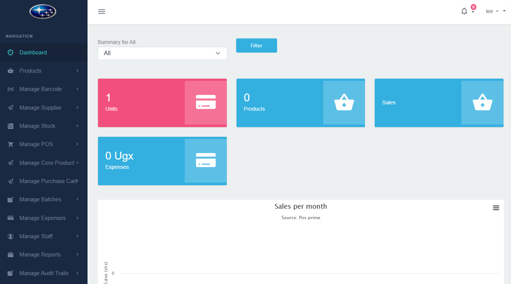

## About Posprime

It is a web application software designed to manage profits and losses in a business.

- Staff module.
- Product module.
- Barcode module.
- Supplier module.
- Stock module.
- POS module.
- Core product module.
- Purchase cart module.
- Batch module.
- Expense module.
- Report module.
- Audit trails module.
- Leave module.
- Task module.
- Notification module.
- Audit Trails module.

## Installation Procedure
- Clone the repository.
- Open the terminal and run the command composure install.
- Open mysql and import the database medicaldb.
- Start the server from terminal with command "php artisan serve".
- Login with credentials.
  Email: lee@gmail.com
  password: 1234

### Navigate through the system and enjoy its customized built in features.
### Cheers !!!
